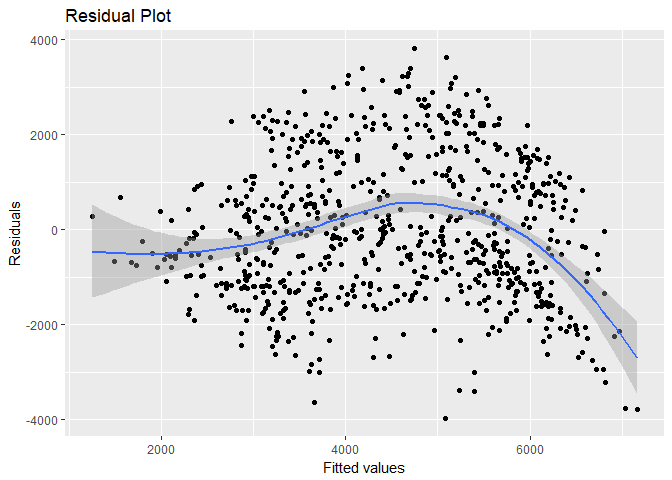

Multilinear Regression
================

<https://en.wikipedia.org/wiki/Linear_regression> Linear regression is a linear approach to modelling the relationship between a scalar response (or dependent variable) and one or more explanatory variables (or independent variables). For more than one explanatory variable, the process is called multiple linear regression.

I'll produce a multilinear model using data from a bike sharing system; I saw in my previous attempt at a linear model that using only one explanatory variable lead to an insufficient model.Hopefully, utilising more of the information available in the dataset will result in a better-performing model.

<http://archive.ics.uci.edu/ml/datasets/Bike+Sharing+Dataset> "Bike sharing systems are new generation of traditional bike rentals where whole process from membership, rental and return back has become automatic. Through these systems, user is able to easily rent a bike from a particular position and return back at another position. Currently, there are about over 500 bike-sharing programs around the world which is composed of over 500 thousands bicycles. Today, there exists great interest in these systems due to their important role in traffic, environmental and health issues."

Attribute Information: - instant: record index - dteday : date - season : season (1:springer, 2:summer, 3:fall, 4:winter) - yr : year (0: 2011, 1:2012) - mnth : month ( 1 to 12) - holiday : weather day is holiday or not (extracted from \[Web Link\]) - weekday : day of the week - workingday : if day is neither weekend nor holiday is 1, otherwise is 0. + weathersit : - 1: Clear, Few clouds, Partly cloudy, Partly cloudy - 2: Mist + Cloudy, Mist + Broken clouds, Mist + Few clouds, Mist - 3: Light Snow, Light Rain + Thunderstorm + Scattered clouds, Light Rain + Scattered clouds - 4: Heavy Rain + Ice Pallets + Thunderstorm + Mist, Snow + Fog - temp : Normalized temperature in Celsius. The values are derived via (t-t\_min)/(t\_max-t\_min), t\_min=-8, t\_max=+39 (only in hourly scale) - atemp: Normalized feeling temperature in Celsius. The values are derived via (t-t\_min)/(t\_max-t\_min), t\_min=-16, t\_max=+50 (only in hourly scale) - hum: Normalized humidity. The values are divided to 100 (max) - windspeed: Normalized wind speed. The values are divided to 67 (max) - casual: count of casual users - registered: count of registered users - cnt: count of total rental bikes including both casual and registered

``` r
#load tidyverse for easy manipulations, visualisations etc
library(tidyverse)
```

    ## Warning: package 'tidyverse' was built under R version 3.5.1

    ## -- Attaching packages ----------------------------------------------------------------------- tidyverse 1.2.1 --

    ## v ggplot2 2.2.1     v purrr   0.2.5
    ## v tibble  1.4.2     v dplyr   0.7.6
    ## v tidyr   0.8.1     v stringr 1.3.1
    ## v readr   1.1.1     v forcats 0.3.0

    ## -- Conflicts -------------------------------------------------------------------------- tidyverse_conflicts() --
    ## x dplyr::filter() masks stats::filter()
    ## x dplyr::lag()    masks stats::lag()

``` r
library(GGally)
```

    ## Warning: package 'GGally' was built under R version 3.5.1

    ## 
    ## Attaching package: 'GGally'

    ## The following object is masked from 'package:dplyr':
    ## 
    ##     nasa

``` r
#read in the dataset
dataset <- read_csv("~/homework env/day.csv")
```

    ## Parsed with column specification:
    ## cols(
    ##   instant = col_integer(),
    ##   dteday = col_date(format = ""),
    ##   season = col_integer(),
    ##   yr = col_integer(),
    ##   mnth = col_integer(),
    ##   holiday = col_integer(),
    ##   weekday = col_integer(),
    ##   workingday = col_integer(),
    ##   weathersit = col_integer(),
    ##   temp = col_double(),
    ##   atemp = col_double(),
    ##   hum = col_double(),
    ##   windspeed = col_double(),
    ##   casual = col_integer(),
    ##   registered = col_integer(),
    ##   cnt = col_integer()
    ## )

``` r
#take a look at the data
head(dataset)
```

    ## # A tibble: 6 x 16
    ##   instant dteday     season    yr  mnth holiday weekday workingday
    ##     <int> <date>      <int> <int> <int>   <int>   <int>      <int>
    ## 1       1 2011-01-01      1     0     1       0       6          0
    ## 2       2 2011-01-02      1     0     1       0       0          0
    ## 3       3 2011-01-03      1     0     1       0       1          1
    ## 4       4 2011-01-04      1     0     1       0       2          1
    ## 5       5 2011-01-05      1     0     1       0       3          1
    ## 6       6 2011-01-06      1     0     1       0       4          1
    ## # ... with 8 more variables: weathersit <int>, temp <dbl>, atemp <dbl>,
    ## #   hum <dbl>, windspeed <dbl>, casual <int>, registered <int>, cnt <int>

``` r
#get a summary of the data
summary(dataset)
```

    ##     instant          dteday               season            yr        
    ##  Min.   :  1.0   Min.   :2011-01-01   Min.   :1.000   Min.   :0.0000  
    ##  1st Qu.:183.5   1st Qu.:2011-07-02   1st Qu.:2.000   1st Qu.:0.0000  
    ##  Median :366.0   Median :2012-01-01   Median :3.000   Median :1.0000  
    ##  Mean   :366.0   Mean   :2012-01-01   Mean   :2.497   Mean   :0.5007  
    ##  3rd Qu.:548.5   3rd Qu.:2012-07-01   3rd Qu.:3.000   3rd Qu.:1.0000  
    ##  Max.   :731.0   Max.   :2012-12-31   Max.   :4.000   Max.   :1.0000  
    ##       mnth          holiday           weekday        workingday   
    ##  Min.   : 1.00   Min.   :0.00000   Min.   :0.000   Min.   :0.000  
    ##  1st Qu.: 4.00   1st Qu.:0.00000   1st Qu.:1.000   1st Qu.:0.000  
    ##  Median : 7.00   Median :0.00000   Median :3.000   Median :1.000  
    ##  Mean   : 6.52   Mean   :0.02873   Mean   :2.997   Mean   :0.684  
    ##  3rd Qu.:10.00   3rd Qu.:0.00000   3rd Qu.:5.000   3rd Qu.:1.000  
    ##  Max.   :12.00   Max.   :1.00000   Max.   :6.000   Max.   :1.000  
    ##    weathersit         temp             atemp              hum        
    ##  Min.   :1.000   Min.   :0.05913   Min.   :0.07907   Min.   :0.0000  
    ##  1st Qu.:1.000   1st Qu.:0.33708   1st Qu.:0.33784   1st Qu.:0.5200  
    ##  Median :1.000   Median :0.49833   Median :0.48673   Median :0.6267  
    ##  Mean   :1.395   Mean   :0.49538   Mean   :0.47435   Mean   :0.6279  
    ##  3rd Qu.:2.000   3rd Qu.:0.65542   3rd Qu.:0.60860   3rd Qu.:0.7302  
    ##  Max.   :3.000   Max.   :0.86167   Max.   :0.84090   Max.   :0.9725  
    ##    windspeed           casual         registered        cnt      
    ##  Min.   :0.02239   Min.   :   2.0   Min.   :  20   Min.   :  22  
    ##  1st Qu.:0.13495   1st Qu.: 315.5   1st Qu.:2497   1st Qu.:3152  
    ##  Median :0.18097   Median : 713.0   Median :3662   Median :4548  
    ##  Mean   :0.19049   Mean   : 848.2   Mean   :3656   Mean   :4504  
    ##  3rd Qu.:0.23321   3rd Qu.:1096.0   3rd Qu.:4776   3rd Qu.:5956  
    ##  Max.   :0.50746   Max.   :3410.0   Max.   :6946   Max.   :8714

``` r
str(dataset)
```

    ## Classes 'tbl_df', 'tbl' and 'data.frame':    731 obs. of  16 variables:
    ##  $ instant   : int  1 2 3 4 5 6 7 8 9 10 ...
    ##  $ dteday    : Date, format: "2011-01-01" "2011-01-02" ...
    ##  $ season    : int  1 1 1 1 1 1 1 1 1 1 ...
    ##  $ yr        : int  0 0 0 0 0 0 0 0 0 0 ...
    ##  $ mnth      : int  1 1 1 1 1 1 1 1 1 1 ...
    ##  $ holiday   : int  0 0 0 0 0 0 0 0 0 0 ...
    ##  $ weekday   : int  6 0 1 2 3 4 5 6 0 1 ...
    ##  $ workingday: int  0 0 1 1 1 1 1 0 0 1 ...
    ##  $ weathersit: int  2 2 1 1 1 1 2 2 1 1 ...
    ##  $ temp      : num  0.344 0.363 0.196 0.2 0.227 ...
    ##  $ atemp     : num  0.364 0.354 0.189 0.212 0.229 ...
    ##  $ hum       : num  0.806 0.696 0.437 0.59 0.437 ...
    ##  $ windspeed : num  0.16 0.249 0.248 0.16 0.187 ...
    ##  $ casual    : int  331 131 120 108 82 88 148 68 54 41 ...
    ##  $ registered: int  654 670 1229 1454 1518 1518 1362 891 768 1280 ...
    ##  $ cnt       : int  985 801 1349 1562 1600 1606 1510 959 822 1321 ...
    ##  - attr(*, "spec")=List of 2
    ##   ..$ cols   :List of 16
    ##   .. ..$ instant   : list()
    ##   .. .. ..- attr(*, "class")= chr  "collector_integer" "collector"
    ##   .. ..$ dteday    :List of 1
    ##   .. .. ..$ format: chr ""
    ##   .. .. ..- attr(*, "class")= chr  "collector_date" "collector"
    ##   .. ..$ season    : list()
    ##   .. .. ..- attr(*, "class")= chr  "collector_integer" "collector"
    ##   .. ..$ yr        : list()
    ##   .. .. ..- attr(*, "class")= chr  "collector_integer" "collector"
    ##   .. ..$ mnth      : list()
    ##   .. .. ..- attr(*, "class")= chr  "collector_integer" "collector"
    ##   .. ..$ holiday   : list()
    ##   .. .. ..- attr(*, "class")= chr  "collector_integer" "collector"
    ##   .. ..$ weekday   : list()
    ##   .. .. ..- attr(*, "class")= chr  "collector_integer" "collector"
    ##   .. ..$ workingday: list()
    ##   .. .. ..- attr(*, "class")= chr  "collector_integer" "collector"
    ##   .. ..$ weathersit: list()
    ##   .. .. ..- attr(*, "class")= chr  "collector_integer" "collector"
    ##   .. ..$ temp      : list()
    ##   .. .. ..- attr(*, "class")= chr  "collector_double" "collector"
    ##   .. ..$ atemp     : list()
    ##   .. .. ..- attr(*, "class")= chr  "collector_double" "collector"
    ##   .. ..$ hum       : list()
    ##   .. .. ..- attr(*, "class")= chr  "collector_double" "collector"
    ##   .. ..$ windspeed : list()
    ##   .. .. ..- attr(*, "class")= chr  "collector_double" "collector"
    ##   .. ..$ casual    : list()
    ##   .. .. ..- attr(*, "class")= chr  "collector_integer" "collector"
    ##   .. ..$ registered: list()
    ##   .. .. ..- attr(*, "class")= chr  "collector_integer" "collector"
    ##   .. ..$ cnt       : list()
    ##   .. .. ..- attr(*, "class")= chr  "collector_integer" "collector"
    ##   ..$ default: list()
    ##   .. ..- attr(*, "class")= chr  "collector_guess" "collector"
    ##   ..- attr(*, "class")= chr "col_spec"

So "dataset" is a data frame with 731 rows and 16 columns. Each row represent a single entry, one day, in which data is recorded about climate conditions, such as temperature and humidity, and the number of bike rentals which occur. This information is stored in the columns.

I'm building a multiple linear regression, so I'll need to select which of the (continuous) explanatory variables to include in my model. I'll check the correlation coefficient between these variables and "cnt", to get an idea of their relationships.

``` r
#set y as "cnt" column
y<- select(dataset, cnt)
#select subset of continuous-value variables
x<- select(dataset, temp, atemp, hum, windspeed)

#get correlation coefficents
cor(x,y)
```

    ##                  cnt
    ## temp       0.6274940
    ## atemp      0.6310657
    ## hum       -0.1006586
    ## windspeed -0.2345450

``` r
#plot correlations
ggcorr(c(x,y))
```


Seemingly, "temp" and "atemp" are fairly strongly, positively, corellated with "cnt", while "hum" and "windspeed" are weakly, negatively correlated. I have four possible variables to choose from, and I wish to construct a multilinear model, so I'll discard "hum" as the weakest correlate. I could use a selection procedure (forward, backward, mixed) to select these within a logical framework.

``` r
newdata <- select(dataset, cnt, temp, atemp, windspeed)
summary(newdata)
```

    ##       cnt            temp             atemp           windspeed      
    ##  Min.   :  22   Min.   :0.05913   Min.   :0.07907   Min.   :0.02239  
    ##  1st Qu.:3152   1st Qu.:0.33708   1st Qu.:0.33784   1st Qu.:0.13495  
    ##  Median :4548   Median :0.49833   Median :0.48673   Median :0.18097  
    ##  Mean   :4504   Mean   :0.49538   Mean   :0.47435   Mean   :0.19049  
    ##  3rd Qu.:5956   3rd Qu.:0.65542   3rd Qu.:0.60860   3rd Qu.:0.23321  
    ##  Max.   :8714   Max.   :0.86167   Max.   :0.84090   Max.   :0.50746

Let's see these plotted against each other.

``` r
#create scatterplot matrix of explanatory variables
ggpairs(newdata, title = "Scatterplot Matrix") 
```


Thus, the relationships are visualised. Note the (easily explainable) link between "temp" and "atemp".

And now I'll visualise my data to get the gist of how each variable is distributed. I'll use a histogram with a red line indicating the median, and a blue line for the mean.

``` r
#plot cnt as a histogram, with mean and median lines
ggplot(gather(newdata), aes(value)) + 
  geom_histogram(bins = 10) + 
  facet_wrap(~key, scales = 'free_x') +
  labs(y="frequency", title = "Histograms of count frequency, by variable") 
```


I wish to solve the equation

Y= B0 + B1 \* X1 + B2 \* X2 + B3 \* X3

Where Y = Count, X1 = Air Temperature, X2 = Temperature, X3 = Windspeed, B0 is my intercept, and Bi denotes the slope coefficient for each Xi. The "lm" function will optimise the values for my {Bi} by minimising the sum of the squares of the distances between my data points and the regression line (The "Least Squares" approach).

``` r
# Centre predictors
atemp.c = scale(newdata$atemp, center=TRUE, scale=FALSE)
temp.c = scale(newdata$temp, center=TRUE, scale=FALSE)
windspeed.c = scale(newdata$windspeed, center=TRUE, scale=FALSE)

# bind these new variables into newdata and display a summary
new.c.vars = cbind(atemp.c, temp.c, windspeed.c)
newdata = cbind(newdata, new.c.vars)
names(newdata)[5:7] = c("atemp.c", "temp.c", "windspeed.c" )
summary(newdata)
```

    ##       cnt            temp             atemp           windspeed      
    ##  Min.   :  22   Min.   :0.05913   Min.   :0.07907   Min.   :0.02239  
    ##  1st Qu.:3152   1st Qu.:0.33708   1st Qu.:0.33784   1st Qu.:0.13495  
    ##  Median :4548   Median :0.49833   Median :0.48673   Median :0.18097  
    ##  Mean   :4504   Mean   :0.49538   Mean   :0.47435   Mean   :0.19049  
    ##  3rd Qu.:5956   3rd Qu.:0.65542   3rd Qu.:0.60860   3rd Qu.:0.23321  
    ##  Max.   :8714   Max.   :0.86167   Max.   :0.84090   Max.   :0.50746  
    ##     atemp.c             temp.c           windspeed.c       
    ##  Min.   :-0.39528   Min.   :-0.436254   Min.   :-0.168095  
    ##  1st Qu.:-0.13651   1st Qu.:-0.158301   1st Qu.:-0.055536  
    ##  Median : 0.01238   Median : 0.002948   Median :-0.009511  
    ##  Mean   : 0.00000   Mean   : 0.000000   Mean   : 0.000000  
    ##  3rd Qu.: 0.13425   3rd Qu.: 0.160032   3rd Qu.: 0.042728  
    ##  Max.   : 0.36654   Max.   : 0.366282   Max.   : 0.316977

``` r
#fit the model
mod = lm(cnt ~ atemp.c + temp.c + windspeed.c, data = newdata)

#summarise results
summary(mod)
```

    ## 
    ## Call:
    ## lm(formula = cnt ~ atemp.c + temp.c + windspeed.c, data = newdata)
    ## 
    ## Residuals:
    ##     Min      1Q  Median      3Q     Max 
    ## -3966.5 -1136.4  -158.5  1044.9  3814.4 
    ## 
    ## Coefficients:
    ##             Estimate Std. Error t value Pr(>|t|)    
    ## (Intercept)  4504.35      54.95  81.965  < 2e-16 ***
    ## atemp.c      3787.23    2686.35   1.410    0.159    
    ## temp.c       3079.68    2380.73   1.294    0.196    
    ## windspeed.c -3251.51     735.45  -4.421 1.13e-05 ***
    ## ---
    ## Signif. codes:  0 '***' 0.001 '**' 0.01 '*' 0.05 '.' 0.1 ' ' 1
    ## 
    ## Residual standard error: 1486 on 727 degrees of freedom
    ## Multiple R-squared:  0.4142, Adjusted R-squared:  0.4117 
    ## F-statistic: 171.3 on 3 and 727 DF,  p-value: < 2.2e-16

And plot this model as a scatterplot in 3 dimensions.

``` r
library(plotly)
```

    ## 
    ## Attaching package: 'plotly'

    ## The following object is masked from 'package:ggplot2':
    ## 
    ##     last_plot

    ## The following object is masked from 'package:stats':
    ## 
    ##     filter

    ## The following object is masked from 'package:graphics':
    ## 
    ##     layout

``` r
#plot scatter
plot_ly(newdata, x = ~atemp.c, y = ~temp.c, z = ~cnt,
        marker = list(color = ~windspeed.c, colorscale = c('#FFE1A1', '#683531'), showscale = TRUE)) %>%
  add_markers() %>%
  layout(scene = list(xaxis = list(title = 'Air Temp', range = range(newdata$atemp.c)),
                     yaxis = list(title = 'Temp', range = range(newdata$temp.c)),
                     zaxis = list(title = 'Count', range = range(newdata$cnt))),
         annotations = list(
           text = 'Windspeed',
           showarrow = FALSE
         ))
```

    ## PhantomJS not found. You can install it with webshot::install_phantomjs(). If it is installed, please make sure the phantomjs executable can be found via the PATH variable.

<!--html_preserve-->

<script type="application/json" data-for="3530701c2869">{"x":{"visdat":{"35303dad6fc0":["function () ","plotlyVisDat"]},"cur_data":"35303dad6fc0","attrs":{"35303dad6fc0":{"x":{},"y":{},"z":{},"marker":{"color":{},"colorscale":["#FFE1A1","#683531"],"showscale":true},"alpha":1,"sizes":[10,100],"type":"scatter3d","mode":"markers"}},"layout":{"margin":{"b":40,"l":60,"t":25,"r":10},"scene":{"xaxis":{"title":"Air Temp","range":[-0.395284388645691,0.366542011354309]},"yaxis":{"title":"Temp","range":[-0.436254388508892,0.366282211491108]},"zaxis":{"title":"Count","range":[22,8714]}},"annotations":[{"text":"Windspeed","showarrow":false}],"xaxis":{"domain":[0,1]},"yaxis":{"domain":[0,1]},"hovermode":"closest","showlegend":false},"source":"A","config":{"modeBarButtonsToAdd":[{"name":"Collaborate","icon":{"width":1000,"ascent":500,"descent":-50,"path":"M487 375c7-10 9-23 5-36l-79-259c-3-12-11-23-22-31-11-8-22-12-35-12l-263 0c-15 0-29 5-43 15-13 10-23 23-28 37-5 13-5 25-1 37 0 0 0 3 1 7 1 5 1 8 1 11 0 2 0 4-1 6 0 3-1 5-1 6 1 2 2 4 3 6 1 2 2 4 4 6 2 3 4 5 5 7 5 7 9 16 13 26 4 10 7 19 9 26 0 2 0 5 0 9-1 4-1 6 0 8 0 2 2 5 4 8 3 3 5 5 5 7 4 6 8 15 12 26 4 11 7 19 7 26 1 1 0 4 0 9-1 4-1 7 0 8 1 2 3 5 6 8 4 4 6 6 6 7 4 5 8 13 13 24 4 11 7 20 7 28 1 1 0 4 0 7-1 3-1 6-1 7 0 2 1 4 3 6 1 1 3 4 5 6 2 3 3 5 5 6 1 2 3 5 4 9 2 3 3 7 5 10 1 3 2 6 4 10 2 4 4 7 6 9 2 3 4 5 7 7 3 2 7 3 11 3 3 0 8 0 13-1l0-1c7 2 12 2 14 2l218 0c14 0 25-5 32-16 8-10 10-23 6-37l-79-259c-7-22-13-37-20-43-7-7-19-10-37-10l-248 0c-5 0-9-2-11-5-2-3-2-7 0-12 4-13 18-20 41-20l264 0c5 0 10 2 16 5 5 3 8 6 10 11l85 282c2 5 2 10 2 17 7-3 13-7 17-13z m-304 0c-1-3-1-5 0-7 1-1 3-2 6-2l174 0c2 0 4 1 7 2 2 2 4 4 5 7l6 18c0 3 0 5-1 7-1 1-3 2-6 2l-173 0c-3 0-5-1-8-2-2-2-4-4-4-7z m-24-73c-1-3-1-5 0-7 2-2 3-2 6-2l174 0c2 0 5 0 7 2 3 2 4 4 5 7l6 18c1 2 0 5-1 6-1 2-3 3-5 3l-174 0c-3 0-5-1-7-3-3-1-4-4-5-6z"},"click":"function(gd) { \n        // is this being viewed in RStudio?\n        if (location.search == '?viewer_pane=1') {\n          alert('To learn about plotly for collaboration, visit:\\n https://cpsievert.github.io/plotly_book/plot-ly-for-collaboration.html');\n        } else {\n          window.open('https://cpsievert.github.io/plotly_book/plot-ly-for-collaboration.html', '_blank');\n        }\n      }"}],"cloud":false},"data":[{"x":[-0.110728988645691,-0.120614988645691,-0.284948988645691,-0.262231988645691,-0.245083988645691,-0.241144988645691,-0.265514988645691,-0.312099988645691,-0.358178988645691,-0.323465988645691,-0.282889988645691,-0.313880988645691,-0.323470988645691,-0.285940988645691,-0.226241988645691,-0.240136988645691,-0.297582988645691,-0.242020988645691,-0.175931988645691,-0.219303988645691,-0.316520988645691,-0.395284388645691,-0.375514888645691,-0.356423988645691,-0.239827988645691,-0.270753988645691,-0.254653988645691,-0.251036988645691,-0.262227988645691,-0.224031988645691,-0.288103988645691,-0.239823988645691,-0.219936988645691,-0.296475988645691,-0.245766988645691,-0.231295988645691,-0.182682988645691,-0.170695988645691,-0.276107988645691,-0.330070988645691,-0.324805988645691,-0.260844988645691,-0.241399988645691,-0.150240988645691,-0.0760039886456909,-0.220079988645691,-0.158153988645691,-0.0456959886456909,0.0376290113543091,-0.0829499886456909,-0.197023988645691,-0.190278988645691,-0.288320988645691,-0.228636988645691,-0.185162988645691,-0.123892988645691,-0.192161988645691,-0.123244988645691,-0.0742359886456909,-0.210474988645691,-0.154282988645691,-0.274220988645691,-0.218674988645691,-0.0955749886456909,-0.108101988645691,-0.235892988645691,-0.171953988645691,-0.187745988645691,-0.0886859886456908,-0.169353988645691,-0.148603988645691,-0.0942629886456908,-0.142353988645691,-0.156175988645691,-0.107423988645691,-0.0640209886456908,0.0526550113543091,-0.00782898864569082,-0.148603988645691,-0.0646189886456908,-0.0337119886456909,-0.136414988645691,-0.203520988645691,-0.218041988645691,-0.216782988645691,-0.224014988645691,-0.216779988645691,-0.181445988645691,-0.177003988645691,-0.216778988645691,-0.190899988645691,-0.158716988645691,-0.0955869886456908,0.0685750113543092,-0.0760039886456909,-0.0867459886456908,-0.0406579886456908,-0.149874988645691,-0.132824988645691,-0.0476169886456909,0.0908630113543091,0.0187000113543092,-0.0570709886456908,-0.0116119886456909,-0.0324409886456908,-0.0488619886456909,-0.0286579886456909,0.0287920113543091,0.0149040113543092,0.0900380113543092,-0.0204619886456908,-0.152399988645691,-0.0242329886456908,0.0774090113543092,0.100146011354309,0.119729011354309,0.100788011354309,0.104575011354309,0.0231090113543092,-0.0103329886456908,-0.0261499886456908,0.0584790113543092,0.107725011354309,-0.0697039886456908,-0.0324369886456908,-0.000236988645690828,0.0382670113543092,0.0445790113543091,0.0508920113543092,0.0483670113543092,0.0540460113543091,0.0490090113543092,0.0199460113543092,0.0262750113543092,0.0616460113543092,0.0761580113543092,0.0641750113543092,0.0528040113543092,0.0363880113543092,0.0546880113543092,0.0976210113543092,0.100146011354309,0.115942011354309,0.130459011354309,0.141188011354309,0.180334011354309,0.162654011354309,0.138025011354309,0.141196011354309,0.196738011354309,0.251029011354309,0.246613011354309,0.169588011354309,0.112779011354309,0.120342011354309,0.142450011354309,0.147504011354309,0.181596011354309,0.252925011354309,0.283225011354309,0.228938011354309,0.203684011354309,0.168971011354309,0.127300011354309,0.117192011354309,0.113400011354309,0.120992011354309,0.126029011354309,0.169600011354309,0.171492011354309,0.120992011354309,0.163292011354309,0.219475011354309,0.219479011354309,0.182229011354309,0.168959011354309,0.163275011354309,0.162650011354309,0.218204011354309,0.180334011354309,0.162654011354309,0.177808011354309,0.192954011354309,0.194221011354309,0.191063011354309,0.221984011354309,0.211279011354309,0.212517011354309,0.196129011354309,0.189804011354309,0.215671011354309,0.255450011354309,0.264921011354309,0.215050011354309,0.160750011354309,0.150017011354309,0.163909011354309,0.195479011354309,0.229571011354309,0.273125011354309,0.272496011354309,0.352017011354309,0.366542011354309,0.329933011354309,0.320475011354309,0.246604011354309,0.222625011354309,0.216313011354309,0.265546011354309,0.311613011354309,0.254183011354309,0.255442011354309,0.228938011354309,0.232717011354309,0.205583011354309,0.190434011354309,0.182213011354309,0.201800011354309,0.240938011354309,0.228929011354309,0.249767011354309,0.210629011354309,0.177167011354309,0.179688011354309,0.171504011354309,0.150034011354309,0.141813011354309,0.171483011354309,0.192317011354309,0.187904011354309,0.158867011354309,0.174642011354309,0.201171011354309,0.163900011354309,0.131713011354309,0.156338011354309,0.171500011354309,0.185379011354309,0.161202011354309,0.173605011354309,0.133604011354309,0.120350011354309,0.136767011354309,0.140567011354309,0.130454011354309,0.158859011354309,0.191075011354309,0.151292011354309,0.0408460113543092,0.0698750113543091,0.0810070113543092,0.104592011354309,0.133608011354309,0.134875011354309,0.127776011354309,0.129200011354309,0.152546011354309,0.0793170113543092,-0.0128789886456908,0.00415801135430915,0.0161830113543092,0.0553210113543092,0.0578630113543092,0.0761790113543092,0.0806090113543091,0.0477710113543091,0.0900580113543092,0.0982830113543091,0.114688011354309,0.100171011354309,0.100804011354309,0.100158011354309,0.0704750113543092,-0.0614909886456909,-0.129036988645691,-0.0823079886456908,-0.00149598864569084,0.0527840113543092,0.00607101135430915,0.0300500113543091,0.0388880113543091,0.0496290113543091,0.0685710113543092,0.0717420113543092,0.0433630113543091,0.0774500113543091,0.0553210113543092,0.0243710113543091,0.0288000113543092,0.0363710113543091,0.0483670113543092,0.0394940113543091,-0.00782898864569082,-0.0507579886456909,-0.0488619886456909,-0.0520209886456908,-0.0172869886456908,-0.0109789886456909,-0.00150798864569085,-0.0173079886456908,-0.155541988645691,-0.246440988645691,-0.153024988645691,-0.118290988645691,-0.0772659886456908,-0.0842209886456908,-0.0684329886456909,-0.0709619886456909,-0.150499988645691,-0.111995988645691,-0.0734829886456909,-0.0621079886456908,-0.0652749886456908,-0.100632988645691,-0.167536988645691,-0.116411988645691,-0.0438039886456909,0.0502580113543091,0.0332250113543092,-0.0223659886456908,-0.151132988645691,-0.201632988645691,-0.149870988645691,-0.0172959886456908,-0.0292919886456908,-0.0526579886456908,-0.0438169886456908,-0.101882988645691,-0.0936829886456909,-0.0892669886456908,-0.0185539886456909,0.0157680113543092,-0.0229789886456908,-0.163132988645691,-0.168799988645691,-0.142920988645691,-0.163749988645691,-0.125253988645691,-0.0804289886456908,-0.0179539886456909,-0.0741079886456908,-0.217415988645691,-0.156811988645691,-0.207941988645691,-0.221199988645691,-0.204157988645691,-0.173215988645691,-0.135991988645691,-0.0621169886456908,-0.114528988645691,-0.224982988645691,-0.228774988645691,-0.193420988645691,-0.0778999886456909,-0.0463369886456909,-0.0482329886456908,-0.0968409886456909,-0.175111988645691,-0.194392988645691,-0.158818988645691,-0.146720988645691,-0.194379988645691,-0.210461988645691,-0.155541988645691,-0.0602329886456908,-0.0987329886456909,-0.222049988645691,-0.348078988645691,-0.355016988645691,-0.195941988645691,-0.134086988645691,-0.0835749886456909,-0.134095988645691,-0.226874988645691,-0.155527988645691,-0.191532988645691,-0.0924159886456908,-0.224991988645691,-0.291266988645691,-0.312728988645691,-0.283690988645691,-0.110075988645691,-0.199099988645691,-0.284315988645691,-0.253395988645691,-0.299478988645691,-0.312103988645691,-0.231295988645691,-0.125245988645691,-0.179532988645691,-0.118303988645691,-0.0589709886456908,-0.147974988645691,-0.201632988645691,-0.211728988645691,-0.0930369886456908,-0.00781598864569083,-0.0753829886456908,-0.165007988645691,-0.201628988645691,-0.209832988645691,-0.177927988645691,-0.113249988645691,-0.207932988645691,-0.212365988645691,-0.180795988645691,-0.263486988645691,-0.372695988645691,-0.246440988645691,-0.140407988645691,-0.122724988645691,-0.144191988645691,-0.122724988645691,-0.118928988645691,-0.208565988645691,-0.200962988645691,-0.179240988645691,-0.0816869886456909,-0.0299079886456908,-0.0633829886456909,-0.218678988645691,-0.206045988645691,-0.116399988645691,-0.120828988645691,-0.125883988645691,0.00101701135430915,-0.114511988645691,-0.0608619886456908,-0.171332988645691,-0.233182988645691,-0.219311988645691,-0.0892539886456908,0.0502500113543091,-0.0772709886456908,-0.196586988645691,-0.114683988645691,-0.0147619886456908,0.0685750113543092,0.0742630113543092,0.0584710113543092,-0.0381249886456909,0.0306920113543092,-0.0103539886456908,0.0584670113543092,0.0641790113543092,0.0389040113543092,0.0572130113543092,0.0957130113543092,0.0123790113543092,-0.0368659886456909,-0.0356039886456909,-0.158699988645691,-0.00340398864569086,0.00795001135430917,-0.0987329886456909,-0.0526459886456908,-0.0570669886456908,-0.0468409886456909,-0.0128709886456909,0.0590960113543091,-0.0431909886456908,-0.0835869886456909,-0.0482249886456909,0.0180710113543092,0.00228401135430917,-0.0381209886456909,-0.137079988645691,-0.0867499886456908,-0.0425459886456908,0.0136420113543091,0.0995210113543092,0.140571011354309,0.124133011354309,-0.0173159886456908,0.0186920113543091,0.0414210113543091,0.0685670113543091,-0.0848499886456908,-0.173228988645691,-0.0690709886456908,-0.00403698864569085,0.00922901135430915,-0.0217169886456908,-0.0968499886456908,-0.0242329886456908,-0.0166579886456908,0.102667011354309,0.0635420113543092,0.0628880113543092,0.116563011354309,0.110254011354309,0.0723830113543092,0.0527880113543092,0.0831170113543092,0.0786710113543092,0.0174290113543092,0.0464790113543092,0.0704630113543092,0.110884011354309,0.0755460113543092,0.102050011354309,0.121621011354309,0.0982590113543092,0.0767670113543091,0.0925540113543091,0.109613011354309,0.0913130113543092,0.106471011354309,0.110258011354309,0.132346011354309,0.153175011354309,0.168342011354309,0.167071011354309,0.204946011354309,0.198638011354309,0.136775011354309,0.156975011354309,0.133608011354309,0.0919340113543092,0.100779011354309,0.103929011354309,0.0515380113543092,0.0679380113543092,0.0950880113543092,0.123508011354309,0.174013011354309,0.189163011354309,0.185367011354309,0.123521011354309,0.136763011354309,0.150029011354309,0.125400011354309,0.120354011354309,0.0976210113543092,0.0704880113543092,0.180338011354309,0.246621011354309,0.278188011354309,0.249767011354309,0.178438011354309,0.199900011354309,0.179688011354309,0.120350011354309,0.166438011354309,0.201158011354309,0.312259011354309,0.213154011354309,0.276275011354309,0.227684011354309,0.228296011354309,0.257983011354309,0.287013011354309,0.278179011354309,0.330559011354309,0.316042011354309,0.179700011354309,0.190442011354309,0.175917011354309,0.180329011354309,0.193579011354309,0.191688011354309,0.230842011354309,0.249771011354309,0.281329011354309,0.271229011354309,0.240288011354309,0.138671011354309,0.0755580113543091,0.148771011354309,0.215663011354309,0.232096011354309,0.179700011354309,0.264909011354309,0.259863011354309,0.223250011354309,0.193579011354309,0.210633011354309,0.188542011354309,0.192954011354309,0.232734011354309,0.248513011354309,0.276913011354309,0.256725011354309,0.235892011354309,0.223267011354309,0.233363011354309,0.225154011354309,0.193588011354309,0.163913011354309,0.170225011354309,0.187900011354309,0.202425011354309,0.179683011354309,0.180334011354309,-0.231953988645691,0.143717011354309,0.129200011354309,0.121613011354309,0.126671011354309,0.147500011354309,0.162654011354309,0.172746011354309,0.144342011354309,0.121642011354309,0.180334011354309,0.191696011354309,0.161379011354309,0.178425011354309,0.215046011354309,0.228300011354309,0.174646011354309,0.187275011354309,0.212534011354309,0.234629011354309,0.180975011354309,0.182850011354309,0.136767011354309,0.104571011354309,0.0913000113543092,0.0799380113543092,0.0957210113543092,0.105204011354309,0.119729011354309,0.111513011354309,0.0887710113543091,0.0786960113543092,0.0907130113543091,0.0660500113543092,0.0578380113543092,0.0976170113543092,0.136134011354309,0.0445790113543091,0.0281590113543091,0.0698250113543091,0.122259011354309,0.133621011354309,0.111509011354309,0.0559420113543092,0.0433090113543091,0.0376460113543092,0.0679790113543091,0.124779011354309,0.133621011354309,0.105833011354309,0.0641670113543092,-0.0545409886456908,-0.0867459886456908,-0.0362419886456908,0.0287880113543091,-0.0431869886456908,-0.0412829886456909,-0.0829579886456908,0.0338500113543092,0.0647960113543092,-0.0135079886456909,-0.0242459886456908,0.0382710113543092,0.0635420113543092,-0.00151198864569085,-0.0179249886456909,0.00858801135430914,0.0559500113543092,0.0843670113543092,0.0553340113543092,0.0483960113543092,0.0407790113543091,-0.00658298864569085,-0.0349539886456908,-0.164444988645691,-0.113253988645691,-0.104411988645691,-0.118311988645691,-0.150507988645691,-0.144815988645691,-0.166278988645691,-0.192786988645691,-0.199732988645691,-0.132462988645691,-0.118940988645691,-0.0804169886456909,-0.0526409886456908,0.00102901135430916,-0.151128988645691,-0.192790988645691,-0.149861988645691,-0.127149988645691,-0.147970988645691,-0.136607988645691,-0.0987329886456909,-0.0936869886456909,-0.109461988645691,-0.123982988645691,-0.0955749886456909,-0.225611988645691,-0.216770988645691,-0.135349988645691,-0.192795988645691,-0.184591988645691,-0.175931988645691,-0.150486988645691,-0.157449988645691,-0.115145988645691,-0.0185579886456909,-0.00529998864569081,-0.0463419886456908,-0.216149988645691,-0.152395988645691,-0.0848459886456908,-0.0842079886456908,-0.0387789886456908,-0.135990988645691,-0.177015988645691,-0.180165988645691,-0.180161988645691,-0.135970988645691,-0.104415988645691,-0.0728539886456908,-0.0646459886456908,-0.132191988645691,-0.139136988645691,-0.172586988645691,-0.238240988645691,-0.214882988645691,-0.215453988645691,-0.179888988645691,-0.254020988645691,-0.247711988645691,-0.219307988645691,-0.231953988645691,-0.242653988645691,-0.250866988645691],"y":[-0.151217788508892,-0.131906788508892,-0.299020788508892,-0.295384788508892,-0.268427788508892,-0.291036788508892,-0.298862788508892,-0.330384788508892,-0.357051788508892,-0.344551788508892,-0.326293788508892,-0.322657788508892,-0.330384788508892,-0.334514788508892,-0.262051788508892,-0.263717788508892,-0.319551788508892,-0.278717788508892,-0.203210788508892,-0.233717788508892,-0.317884788508892,-0.436254388508892,-0.398863088508892,-0.397993488508892,-0.271906788508892,-0.277884788508892,-0.300384788508892,-0.291906788508892,-0.298862788508892,-0.278862788508892,-0.314551788508892,-0.303210788508892,-0.235384788508892,-0.308427788508892,-0.284080788508892,-0.262051788508892,-0.209551788508892,-0.223717788508892,-0.274551788508892,-0.360601788508892,-0.351036788508892,-0.306293788508892,-0.272884788508892,-0.178862788508892,-0.080384788508892,-0.229297788508892,-0.177123788508892,-0.0595517885088919,0.026282211491108,-0.096217788508892,-0.210167788508892,-0.192051788508892,-0.313162788508892,-0.273645788508892,-0.199732788508892,-0.131036788508892,-0.212884788508892,-0.151906788508892,-0.088111788508892,-0.228717788508892,-0.160384788508892,-0.297051788508892,-0.233717788508892,-0.111217788508892,-0.118862788508892,-0.233645788508892,-0.202884788508892,-0.199551788508892,-0.106293788508892,-0.178862788508892,-0.166217788508892,-0.111036788508892,-0.170167788508892,-0.177993788508892,-0.130167788508892,-0.080384788508892,0.0446152114911081,-0.022884788508892,-0.162884788508892,-0.0649497885088919,-0.053717788508892,-0.148427788508892,-0.210384788508892,-0.231217788508892,-0.229551788508892,-0.242341788508892,-0.231036788508892,-0.192884788508892,-0.195384788508892,-0.227051788508892,-0.195384788508892,-0.180384788508892,-0.117051788508892,0.077948211491108,-0.0812177885088919,-0.104551788508892,-0.0578847885088919,-0.159551788508892,-0.152884788508892,-0.0687177885088919,0.100267211491108,0.007115211491108,-0.082884788508892,-0.0278847885088919,-0.048717788508892,-0.0645517885088919,-0.038717788508892,0.017115211491108,0.010448211491108,0.099615211491108,-0.036217788508892,-0.158717788508892,-0.0353847885088919,0.0862822114911081,0.111282211491108,0.136282211491108,0.124615211491108,0.122115211491108,0.0146152114911081,-0.022884788508892,-0.043717788508892,0.053782211491108,0.121282211491108,-0.0812177885088919,-0.036217788508892,-0.0162177885088919,0.0246152114911081,0.0329482114911081,0.037115211491108,0.037115211491108,0.047115211491108,0.0396152114911081,0.017115211491108,0.025448211491108,0.0671152114911081,0.0821152114911081,0.0662822114911081,0.0546152114911081,0.0354482114911081,0.0412822114911081,0.107115211491108,0.108782211491108,0.136282211491108,0.164615211491108,0.165448211491108,0.212948211491108,0.186282211491108,0.160448211491108,0.172115211491108,0.237948211491108,0.279615211491108,0.268782211491108,0.219615211491108,0.124615211491108,0.139615211491108,0.152948211491108,0.182948211491108,0.212115211491108,0.280448211491108,0.312948211491108,0.259615211491108,0.229615211491108,0.197115211491108,0.139615211491108,0.108782211491108,0.131282211491108,0.132948211491108,0.153782211491108,0.201282211491108,0.203782211491108,0.139615211491108,0.185448211491108,0.237948211491108,0.232948211491108,0.228782211491108,0.199615211491108,0.184615211491108,0.187115211491108,0.248782211491108,0.232948211491108,0.201282211491108,0.227115211491108,0.242948211491108,0.221282211491108,0.231282211491108,0.251282211491108,0.224615211491108,0.254615211491108,0.213782211491108,0.237948211491108,0.252115211491108,0.267115211491108,0.298782211491108,0.251282211491108,0.185448211491108,0.167948211491108,0.191282211491108,0.223782211491108,0.251282211491108,0.281282211491108,0.272948211491108,0.319615211491108,0.352948211491108,0.353782211491108,0.334615211491108,0.247948211491108,0.276282211491108,0.279615211491108,0.283782211491108,0.342948211491108,0.308782211491108,0.310448211491108,0.276282211491108,0.287948211491108,0.236282211491108,0.214615211491108,0.215448211491108,0.221282211491108,0.247115211491108,0.269615211491108,0.279615211491108,0.271282211491108,0.222115211491108,0.212948211491108,0.190448211491108,0.181282211491108,0.170448211491108,0.205448211491108,0.227948211491108,0.216282211491108,0.189615211491108,0.202115211491108,0.215448211491108,0.196282211491108,0.145448211491108,0.177948211491108,0.188782211491108,0.204615211491108,0.184615211491108,0.211674211491108,0.141282211491108,0.143782211491108,0.161282211491108,0.159615211491108,0.147948211491108,0.173782211491108,0.213782211491108,0.177948211491108,0.0446152114911081,0.103782211491108,0.138528211491108,0.154615211491108,0.164615211491108,0.157948211491108,0.148963211491108,0.155448211491108,0.177948211491108,0.0821152114911081,-0.0262177885088919,-0.00371778850889193,0.012115211491108,0.053782211491108,0.0662822114911081,0.099615211491108,0.132948211491108,0.113782211491108,0.111282211491108,0.138782211491108,0.153782211491108,0.141282211491108,0.139615211491108,0.121282211491108,0.068782211491108,-0.085384788508892,-0.138717788508892,-0.111217788508892,-0.0112177885088919,0.042948211491108,-0.00121778850889193,0.015448211491108,0.026282211491108,0.0454482114911081,0.0754482114911081,0.0712822114911081,0.047948211491108,0.093782211491108,0.0554482114911081,0.011282211491108,0.016282211491108,0.038782211491108,0.037115211491108,0.046354211491108,-0.0195517885088919,-0.067884788508892,-0.072884788508892,-0.0737177885088919,-0.032051788508892,-0.0237177885088919,-0.0112177885088919,-0.025384788508892,-0.164551788508892,-0.241217788508892,-0.176217788508892,-0.155384788508892,-0.094551788508892,-0.117884788508892,-0.0870517885088919,-0.092051788508892,-0.168717788508892,-0.147051788508892,-0.100384788508892,-0.0870517885088919,-0.0953847885088919,-0.115384788508892,-0.171217788508892,-0.138717788508892,-0.054551788508892,0.0346152114911081,0.0346152114911081,-0.038717788508892,-0.153717788508892,-0.221217788508892,-0.166217788508892,-0.032051788508892,-0.0478847885088919,-0.0787177885088919,-0.054551788508892,-0.122051788508892,-0.120384788508892,-0.119551788508892,-0.036217788508892,0.00809321149110803,-0.037051788508892,-0.170384788508892,-0.182884788508892,-0.181217788508892,-0.196217788508892,-0.164551788508892,-0.109551788508892,-0.0328847885088919,-0.085384788508892,-0.229551788508892,-0.204551788508892,-0.220384788508892,-0.274551788508892,-0.257051788508892,-0.212884788508892,-0.177884788508892,-0.072884788508892,-0.120384788508892,-0.237051788508892,-0.257051788508892,-0.218717788508892,-0.109551788508892,-0.0670517885088919,-0.0720517885088919,-0.122051788508892,-0.192884788508892,-0.220601788508892,-0.173645788508892,-0.170384788508892,-0.196254788508892,-0.247051788508892,-0.183717788508892,-0.085384788508892,-0.125384788508892,-0.222341788508892,-0.345384788508892,-0.387884788508892,-0.229551788508892,-0.161217788508892,-0.102051788508892,-0.157884788508892,-0.271217788508892,-0.186688788508892,-0.221217788508892,-0.112884788508892,-0.221217788508892,-0.315384788508892,-0.328717788508892,-0.305384788508892,-0.122341788508892,-0.192051788508892,-0.305384788508892,-0.277884788508892,-0.322051788508892,-0.332884788508892,-0.277051788508892,-0.152884788508892,-0.201217788508892,-0.153717788508892,-0.070384788508892,-0.179551788508892,-0.212884788508892,-0.226217788508892,-0.105384788508892,-0.0262177885088919,-0.096217788508892,-0.182051788508892,-0.231217788508892,-0.229551788508892,-0.212775788508892,-0.141217788508892,-0.238717788508892,-0.230384788508892,-0.214551788508892,-0.271217788508892,-0.367884788508892,-0.272884788508892,-0.176217788508892,-0.147051788508892,-0.178717788508892,-0.152051788508892,-0.148717788508892,-0.215384788508892,-0.215384788508892,-0.207558788508892,-0.099551788508892,-0.041217788508892,-0.087884788508892,-0.204551788508892,-0.216217788508892,-0.128717788508892,-0.136217788508892,-0.151036788508892,-0.00955178850889193,-0.142051788508892,-0.0812177885088919,-0.169551788508892,-0.252051788508892,-0.237051788508892,-0.091217788508892,0.032115211491108,-0.0845517885088919,-0.207884788508892,-0.133645788508892,-0.028717788508892,0.069615211491108,0.0771152114911081,0.062115211491108,-0.0595517885088919,0.0187822114911081,-0.022884788508892,0.0496152114911081,0.0654482114911081,0.0362822114911081,0.058782211491108,0.106282211491108,0.007115211491108,-0.0578847885088919,-0.049551788508892,-0.172051788508892,-0.0112177885088919,-0.00121778850889193,-0.125384788508892,-0.0712177885088919,-0.0695517885088919,-0.061471788508892,-0.028717788508892,0.0462822114911081,-0.060384788508892,-0.092051788508892,-0.0578847885088919,0.00461521149110805,-0.00621778850889193,-0.048717788508892,-0.146688788508892,-0.0978847885088919,-0.0528847885088919,-0.000384788508891953,0.111282211491108,0.168782211491108,0.112948211491108,-0.032051788508892,0.00294821149110808,0.031282211491108,0.074615211491108,-0.098717788508892,-0.173717788508892,-0.0820517885088919,-0.0187177885088919,0.00294821149110808,-0.0378847885088919,-0.118717788508892,-0.037051788508892,-0.031217788508892,0.117948211491108,0.068782211491108,0.0646152114911081,0.132115211491108,0.126282211491108,0.0671152114911081,0.042115211491108,0.0862822114911081,0.079615211491108,0.010448211491108,0.037948211491108,0.068782211491108,0.117115211491108,0.077948211491108,0.116282211491108,0.141282211491108,0.0979482114911081,0.068782211491108,0.104615211491108,0.125448211491108,0.102948211491108,0.119615211491108,0.126282211491108,0.159615211491108,0.184615211491108,0.197115211491108,0.194615211491108,0.217115211491108,0.227115211491108,0.161282211491108,0.184615211491108,0.158782211491108,0.087948211491108,0.107115211491108,0.102115211491108,0.0454482114911081,0.058782211491108,0.107115211491108,0.153782211491108,0.215448211491108,0.231282211491108,0.225448211491108,0.157948211491108,0.160448211491108,0.152948211491108,0.143782211491108,0.136282211491108,0.0971152114911081,0.072948211491108,0.192948211491108,0.287115211491108,0.310448211491108,0.282115211491108,0.236282211491108,0.247948211491108,0.220448211491108,0.135448211491108,0.202115211491108,0.253782211491108,0.338782211491108,0.269615211491108,0.320448211491108,0.286282211491108,0.285448211491108,0.293782211491108,0.332115211491108,0.332948211491108,0.366282211491108,0.327115211491108,0.215448211491108,0.225448211491108,0.221282211491108,0.220448211491108,0.236282211491108,0.207948211491108,0.250448211491108,0.267948211491108,0.322948211491108,0.297948211491108,0.274615211491108,0.170448211491108,0.100448211491108,0.172115211491108,0.246282211491108,0.255448211491108,0.228782211491108,0.281282211491108,0.286282211491108,0.260448211491108,0.226282211491108,0.235448211491108,0.217948211491108,0.222115211491108,0.257115211491108,0.270448211491108,0.297948211491108,0.273782211491108,0.257115211491108,0.240448211491108,0.254615211491108,0.260448211491108,0.220448211491108,0.197115211491108,0.205448211491108,0.225448211491108,0.231282211491108,0.211282211491108,0.223782211491108,0.227948211491108,0.182948211491108,0.140448211491108,0.140448211491108,0.153782211491108,0.172115211491108,0.200448211491108,0.207115211491108,0.166282211491108,0.157948211491108,0.207948211491108,0.232948211491108,0.189615211491108,0.211282211491108,0.268782211491108,0.257948211491108,0.201282211491108,0.212115211491108,0.230448211491108,0.241282211491108,0.201282211491108,0.207948211491108,0.163782211491108,0.114615211491108,0.087948211491108,0.0821152114911081,0.103782211491108,0.117115211491108,0.137948211491108,0.112948211491108,0.084615211491108,0.0854482114911081,0.127948211491108,0.057115211491108,0.0512822114911081,0.103782211491108,0.154615211491108,0.0337822114911081,0.0187822114911081,0.0546152114911081,0.139615211491108,0.154615211491108,0.123782211491108,0.047115211491108,0.031282211491108,0.025448211491108,0.0954482114911081,0.162115211491108,0.162115211491108,0.119615211491108,0.058782211491108,-0.0795517885088919,-0.112051788508892,-0.048717788508892,0.0187822114911081,-0.060384788508892,-0.0578847885088919,-0.102051788508892,0.026282211491108,0.0662822114911081,-0.0270517885088919,-0.039551788508892,0.027115211491108,0.067948211491108,-0.0112177885088919,-0.031217788508892,-0.00788478850889196,0.048782211491108,0.0921152114911081,0.0546152114911081,0.0504482114911081,0.0346152114911081,-0.017884788508892,-0.0553847885088919,-0.177202788508892,-0.137884788508892,-0.129551788508892,-0.140384788508892,-0.152051788508892,-0.169551788508892,-0.176217788508892,-0.214551788508892,-0.199551788508892,-0.143210788508892,-0.133717788508892,-0.106217788508892,-0.0745517885088919,-0.010384788508892,-0.152051788508892,-0.206217788508892,-0.173717788508892,-0.150384788508892,-0.170384788508892,-0.152884788508892,-0.114551788508892,-0.121217788508892,-0.142051788508892,-0.155384788508892,-0.127051788508892,-0.217051788508892,-0.249551788508892,-0.182051788508892,-0.203717788508892,-0.198717788508892,-0.214514788508892,-0.197051788508892,-0.197051788508892,-0.147884788508892,-0.0428847885088919,-0.0195517885088919,-0.057051788508892,-0.239551788508892,-0.174551788508892,-0.113717788508892,-0.111217788508892,-0.0595517885088919,-0.142051788508892,-0.197884788508892,-0.199551788508892,-0.213717788508892,-0.171217788508892,-0.132884788508892,-0.102051788508892,-0.0845517885088919,-0.162884788508892,-0.165384788508892,-0.168717788508892,-0.229551788508892,-0.249551788508892,-0.264080788508892,-0.204080788508892,-0.252051788508892,-0.241217788508892,-0.242051788508892,-0.242051788508892,-0.239551788508892,-0.279551788508892],"z":[985,801,1349,1562,1600,1606,1510,959,822,1321,1263,1162,1406,1421,1248,1204,1000,683,1650,1927,1543,981,986,1416,1985,506,431,1167,1098,1096,1501,1360,1526,1550,1708,1005,1623,1712,1530,1605,1538,1746,1472,1589,1913,1815,2115,2475,2927,1635,1812,1107,1450,1917,1807,1461,1969,2402,1446,1851,2134,1685,1944,2077,605,1872,2133,1891,623,1977,2132,2417,2046,2056,2192,2744,3239,3117,2471,2077,2703,2121,1865,2210,2496,1693,2028,2425,1536,1685,2227,2252,3249,3115,1795,2808,3141,1471,2455,2895,3348,2034,2162,3267,3126,795,3744,3429,3204,3944,4189,1683,4036,4191,4073,4400,3872,4058,4595,5312,3351,4401,4451,2633,4433,4608,4714,4333,4362,4803,4182,4864,4105,3409,4553,3958,4123,3855,4575,4917,5805,4660,4274,4492,4978,4677,4679,4758,4788,4098,3982,3974,4968,5312,5342,4906,4548,4833,4401,3915,4586,4966,4460,5020,4891,5180,3767,4844,5119,4744,4010,4835,4507,4790,4991,5202,5305,4708,4648,5225,5515,5362,5119,4649,6043,4665,4629,4592,4040,5336,4881,4086,4258,4342,5084,5538,5923,5302,4458,4541,4332,3784,3387,3285,3606,3840,4590,4656,4390,3846,4475,4302,4266,4845,3574,4576,4866,4294,3785,4326,4602,4780,4792,4905,4150,3820,4338,4725,4694,3805,4153,5191,3873,4758,5895,5130,3542,4661,1115,4334,4634,5204,5058,5115,4727,4484,4940,3351,2710,1996,1842,3544,5345,5046,4713,4763,4785,3659,4760,4511,4274,4539,3641,4352,4795,2395,5423,5010,4630,4120,3907,4839,5202,2429,2918,3570,4456,4826,4765,4985,5409,5511,5117,4563,2416,2913,3644,5217,5041,4570,4748,2424,4195,4304,4308,4381,4187,4687,3894,2659,3747,627,3331,3669,4068,4186,3974,4046,3926,3649,4035,4205,4109,2933,3368,4067,3717,4486,4195,1817,3053,3392,3663,3520,2765,1607,2566,1495,2792,3068,3071,3867,2914,3613,3727,3940,3614,3485,3811,2594,705,3322,3620,3190,2743,3310,3523,3740,3709,3577,2739,2431,3403,3750,2660,3068,2209,1011,754,1317,1162,2302,2423,2999,2485,2294,1951,2236,2368,3272,4098,4521,3425,2376,3598,2177,4097,3214,2493,2311,2298,2935,3376,3292,3163,1301,1977,2432,4339,4270,4075,3456,4023,3243,3624,4509,4579,3761,4151,2832,2947,3784,4375,2802,3830,3831,2169,1529,3422,3922,4169,3005,4154,4318,2689,3129,3777,4773,5062,3487,2732,3389,4322,4363,1834,4990,3194,4066,3423,3333,3956,4916,5382,4569,4118,4911,5298,5847,6312,6192,4378,7836,5892,6153,6093,6230,6871,8362,3372,4996,5558,5102,5698,6133,5459,6235,6041,5936,6772,6436,6457,6460,6857,5169,5585,5918,4862,5409,6398,7460,7132,6370,6691,4367,6565,7290,6624,1027,3214,5633,6196,5026,6233,4220,6304,5572,5740,6169,6421,6296,6883,6359,6273,5728,4717,6572,7030,7429,6118,2843,5115,7424,7384,7639,8294,7129,4359,6073,5260,6770,6734,6536,6591,6043,5743,6855,7338,4127,8120,7641,6998,7001,7055,7494,7736,7498,6598,6664,4972,7421,7363,7665,7702,6978,5099,6825,6211,5905,5823,7458,6891,6779,7442,7335,6879,5463,5687,5531,6227,6660,7403,6241,6207,4840,4672,6569,6290,7264,7446,7499,6969,6031,6830,6786,5713,6591,5870,4459,7410,6966,7592,8173,6861,6904,6685,6597,7105,7216,7580,7261,7175,6824,5464,7013,7273,7534,7286,5786,6299,6544,6883,6784,7347,7605,7148,7865,4549,6530,7006,7375,7765,7582,6053,5255,6917,7040,7697,7713,7350,6140,5810,6034,6864,7112,6203,7504,5976,8227,7525,7767,7870,7804,8009,8714,7333,6869,4073,7591,7720,8167,8395,7907,7436,7538,7733,7393,7415,8555,6889,6778,4639,7572,7328,8156,7965,3510,5478,6392,7691,7570,7282,7109,6639,5875,7534,7461,7509,5424,8090,6824,7058,7466,7693,7359,7444,7852,4459,22,1096,5566,5986,5847,5138,5107,5259,5686,5035,5315,5992,6536,6852,6269,4094,5495,5445,5698,5629,4669,5499,5634,5146,2425,3910,2277,2424,5087,3959,5260,5323,5668,5191,4649,6234,6606,5729,5375,5008,5582,3228,5170,5501,5319,5532,5611,5047,3786,4585,5557,5267,4128,3623,1749,1787,920,1013,441,2114,3095,1341,1796,2729],"marker":{"fillcolor":"rgba(31,119,180,1)","color":[-0.030040211627907,0.058052788372093,0.057822788372093,-0.030190211627907,-0.00358621162790695,-0.100921011627907,-0.021760211627907,0.076317788372093,0.171463788372093,0.032780788372093,-0.068354211627907,0.114140788372093,0.110513788372093,-0.063938211627907,-0.032523211627907,-0.00205321162790698,0.00353078837209303,-0.043711211627907,0.017830788372093,0.00541778837209303,0.162755788372093,-0.018516211627907,0.056113788372093,-0.032156211627907,-0.060690211627907,0.103363788372093,-0.076649211627907,-0.067186211627907,-0.045121211627907,-0.116503611627907,-0.00329421162790697,-0.137273211627907,0.073821788372093,0.087265788372093,-0.062647211627907,-0.029407211627907,-0.048686211627907,-0.145077911627907,0.171463788372093,-0.00164721162790696,0.031448788372093,-0.081936211627907,0.012880788372093,0.070396788372093,0.227421788372093,0.100887788372093,0.061304788372093,0.039617788372093,0.0744387883720931,0.316976788372093,0.032748788372093,0.117359788372093,0.00519678837209303,-0.096373211627907,0.060009788372093,0.156052788372093,-0.00391521162790698,-0.065238211627907,0.099199788372093,0.025938788372093,0.117346788372093,0.035267788372093,0.012859788372093,0.061384788372093,0.152800788372093,0.150865788372093,-0.069836211627907,0.029663788372093,0.0713907883720931,0.042483788372093,0.030288788372093,0.080117788372093,-0.053560211627907,-0.00617721162790696,0.012630788372093,0.019092788372093,0.040530788372093,0.177680788372093,0.017234788372093,0.098296788372093,0.035263788372093,0.043774788372093,0.053300788372093,0.040238788372093,0.019084788372093,-0.00618621162790697,0.021717788372093,0.036509788372093,-0.017598211627907,0.027159788372093,0.068221788372093,0.00665978837209302,-0.00827321162790695,0.195084788372093,0.197580788372093,0.072576788372093,-0.028174211627907,0.036505788372093,-0.057403211627907,-0.043719211627907,0.133987788372093,0.084392788372093,0.060130788372093,-0.079786211627907,0.035888788372093,0.150321788372093,0.113009788372093,-0.026919211627907,-0.032515211627907,0.051438788372093,0.134771788372093,0.029034788372093,0.040238788372093,0.00168878837209305,-0.00515321162790697,0.136013788372093,0.121713788372093,0.130421788372093,0.049576788372093,0.044588788372093,-0.084132211627907,-0.00703221162790696,0.152180788372093,0.138509788372093,0.104905788372093,0.037759788372093,-0.030036211627907,-0.115848711627907,-0.014486211627907,-0.074815211627907,-0.069844211627907,-0.000819211627906963,-0.010761211627907,-0.055536211627907,-0.037507211627907,-0.063615211627907,0.086867788372093,0.011005788372093,-0.082273211627907,-0.065473211627907,-0.069836211627907,-0.042478211627907,0.043355788372093,0.016605788372093,-0.036253211627907,0.00915578837209302,0.050192788372093,0.039605788372093,0.023451788372093,-0.059261211627907,-0.079157211627907,0.016605788372093,0.101800788372093,0.062634788372093,-0.067344211627907,-0.051794211627907,-0.068590211627907,-0.00267821162790696,-0.053669211627907,-0.040603211627907,-0.049932211627907,-0.035636211627907,-0.026919211627907,0.114863788372093,0.078796788372093,-0.022574211627907,0.015984788372093,-0.047457211627907,-0.071078211627907,-0.088486211627907,-0.035011211627907,-0.019461211627907,-0.018224211627907,0.048317788372093,0.031538788372093,0.019084788372093,-0.095952911627907,-0.082898211627907,-0.046203211627907,0.0713347883720931,-0.00517421162790696,-0.087878211627907,-0.075424211627907,0.038371788372093,-0.109007011627907,-0.064228211627907,-0.040603211627907,-0.031286211627907,0.034642788372093,-0.022574211627907,-0.00701521162790697,0.091850788372093,0.00976778837209302,-0.044353211627907,0.050180788372093,-0.00765321162790697,0.017855788372093,0.054546788372093,0.025317788372093,-0.059886211627907,-0.076669211627907,0.031534788372093,-0.057386211627907,-0.059265211627907,-0.021315211627907,-0.099677911627907,0.00977178837209303,-0.00702321162790698,-0.012007211627907,-0.016348211627907,-0.021949211627907,-0.025673211627907,-0.033769211627907,0.015363788372093,-0.054903211627907,0.00666378837209303,-0.00579021162790697,0.037763788372093,0.011000788372093,0.00168878837209305,-0.039365211627907,0.00977178837209303,-0.025690211627907,-0.064865211627907,0.020967788372093,0.032146788372093,0.018467788372093,0.045842788372093,-0.046819211627907,0.042721788372093,-0.051178211627907,-0.086019211627907,0.058267788372093,0.086263788372093,-0.043723211627907,0.062621788372093,0.020346788372093,-0.106523711627907,0.185130788372093,0.114172788372093,-0.030661211627907,-0.065478211627907,-0.107152911627907,-0.048690211627907,-0.050557211627907,-0.00516121162790698,0.015980788372093,0.022209788372093,0.153456788372093,-0.093465411627907,0.00226178837209304,-0.066107211627907,-0.036878211627907,-0.075432211627907,-0.101573211627907,-0.048682211627907,-0.023186211627907,0.080659788372093,-0.026303211627907,-0.000811211627906955,-0.012003211627907,-0.038744211627907,-0.055532211627907,-0.094082011627907,-0.062361211627907,-0.112119511627907,-0.112102911627907,-0.140107011627907,-0.079786211627907,-0.072315211627907,-0.041857211627907,-0.017603211627907,0.015988788372093,0.101809788372093,0.031526788372093,-0.107140411627907,0.015367788372093,-0.013236211627907,-0.055532211627907,-0.168094511627907,-0.145082011627907,-0.127036211627907,-0.148182011627907,-0.047444211627907,0.057663788372093,-0.048699211627907,0.033396788372093,0.067596788372093,0.091230788372093,-0.015107211627907,-0.080399211627907,0.052852788372093,0.231788788372093,0.030909788372093,-0.097819511627907,-0.090973711627907,-0.071694211627907,-0.023828211627907,-0.041844211627907,0.00727678837209303,0.038992788372093,0.160884788372093,-0.013869211627907,-0.084136211627907,-0.054915211627907,-0.108394511627907,-0.053669211627907,0.081292788372093,-0.00142421162790696,-0.098432011627907,-0.133261211627907,-0.121448711627907,-0.128290411627907,-0.00141921162790695,0.124188788372093,0.021575788372093,0.091234788372093,0.116109788372093,0.00914678837209304,-0.053657211627907,0.114875788372093,-0.021953211627907,0.034009788372093,-0.00453621162790696,-0.052432211627907,-0.071694211627907,0.145338788372093,-0.023182211627907,-0.091590411627907,-0.122065411627907,0.018467788372093,-0.048364211627907,0.067605788372093,0.080671788372093,0.029671788372093,-0.089732211627907,-0.094702911627907,-0.106527911627907,-0.128277911627907,0.042096788372093,0.075688788372093,0.049571788372093,-0.107769511627907,0.042734788372093,-0.123944511627907,-0.127036211627907,-0.049936211627907,-0.129527911627907,0.077555788372093,0.070088788372093,0.052680788372093,-0.020707211627907,-0.017590211627907,-0.128915411627907,0.030913788372093,-0.143211211627907,0.083759788372093,-0.000182211627906964,-0.035395211627907,0.048978788372093,-0.00203621162790696,0.103474788372093,-0.071074211627907,-0.056149211627907,0.029667788372093,0.00168078837209304,0.139178788372093,0.175184788372093,-0.00578621162790696,-0.060499211627907,-0.022578211627907,-0.015728211627907,0.00105578837209303,-0.091586211627907,-0.00293421162790697,-0.059265211627907,-0.00951921162790698,0.187621788372093,-0.00330321162790698,0.060771788372093,0.040871788372093,0.158643788372093,0.224942788372093,0.029671788372093,0.012263788372093,0.032155788372093,0.00915178837209304,-0.079778211627907,-0.066719211627907,-0.029415211627907,-0.117090411627907,0.152180788372093,0.020342788372093,0.049563788372093,0.025305788372093,0.0713307883720931,-0.00141921162790695,-0.00329921162790697,-0.011990211627907,-0.068590211627907,-0.014490211627907,-0.036686211627907,-0.043107211627907,-0.056765211627907,0.00355078837209302,-0.073557211627907,0.099309788372093,0.218725788372093,-0.023203211627907,-0.049307211627907,-0.00888621162790695,-0.099061211627907,0.015359788372093,0.000442788372093023,0.062625788372093,0.038596788372093,0.015230788372093,0.043984788372093,0.000426788372093034,0.047080788372093,0.231155788372093,0.014742788372093,0.0775467883720931,0.00293078837209304,-0.011369211627907,0.036500788372093,-0.045582211627907,-0.029407211627907,0.144084788372093,0.038371788372093,0.010388788372093,0.155292788372093,0.251076788372093,0.224313788372093,0.035263788372093,0.032100788372093,0.017226788372093,0.046463788372093,-0.075424211627907,-0.040603211627907,-0.077294211627907,-0.079782211627907,-0.063603211627907,-0.028169211627907,-0.069215211627907,-0.100927911627907,-0.072924211627907,-0.074186211627907,0.00229678837209304,0.030288788372093,0.196334788372093,-0.00329421162790697,0.101184788372093,0.129163788372093,-0.052419211627907,0.060130788372093,-0.018219211627907,0.121652788372093,-0.090353211627907,-0.00951121162790697,0.029042788372093,0.109901788372093,0.084384788372093,0.042109788372093,0.167709788372093,0.058888788372093,0.104787788372093,0.099942788372093,-0.035015211627907,0.000430788372093038,0.034642788372093,0.094342788372093,0.083142788372093,-0.022574211627907,-0.124557011627907,-0.040615211627907,0.093100788372093,0.154059788372093,0.113009788372093,0.058896788372093,-0.071694211627907,-0.013861211627907,0.157146788372093,-0.060511211627907,-0.073578211627907,-0.018848211627907,-0.034390211627907,-0.052428211627907,-0.056790211627907,-0.027548211627907,-0.037494211627907,-0.040607211627907,0.040234788372093,0.105542788372093,0.025925788372093,0.123576788372093,0.046450788372093,-0.067353211627907,0.034630788372093,0.022205788372093,-0.043094211627907,-0.067974211627907,0.038988788372093,-0.053669211627907,-0.106511211627907,0.063880788372093,0.042717788372093,-0.072319211627907,-0.088486211627907,-0.017590211627907,-0.049936211627907,0.00850578837209304,0.024684788372093,0.00603478837209304,0.104913788372093,-0.056157211627907,0.00479278837209304,0.047076788372093,-0.00392421162790696,-0.00639921162790696,0.094346788372093,0.019088788372093,-0.113361211627907,-0.033136211627907,-0.015103211627907,-0.046199211627907,-0.056765211627907,0.017226788372093,0.024059788372093,0.152792788372093,0.063246788372093,-0.013869211627907,-0.023819211627907,-0.045582211627907,-0.015740211627907,-0.042469211627907,-0.076674211627907,-0.071699211627907,-0.00764421162790696,-0.010765211627907,-0.044961211627907,0.109896788372093,0.157155788372093,0.081288788372093,-0.018836211627907,-0.025069211627907,-0.029415211627907,-0.021957211627907,0.00478078837209303,-0.064249211627907,-0.055536211627907,0.00354278837209304,-0.044344211627907,-0.026932211627907,-0.064857211627907,-0.00951121162790697,-0.038749211627907,-0.038753211627907,-0.043711211627907,-0.109636211627907,-0.046807211627907,-0.023819211627907,-0.026299211627907,-0.076057211627907,-0.053044211627907,-0.025057211627907,0.018480788372093,0.022813788372093,-0.096565411627907,-0.051803211627907,0.020967788372093,-0.025686211627907,0.094326788372093,-0.037494211627907,-0.033136211627907,-0.020090211627907,-0.036869211627907,-0.025061211627907,-0.049307211627907,-0.061132211627907,0.025305788372093,0.0669717883720931,0.099934788372093,-0.061132211627907,-0.073578211627907,-0.079786211627907,-0.034386211627907,0.048326788372093,0.015992788372093,-0.067974211627907,-0.054274211627907,-0.021328211627907,-0.020715211627907,-0.048690211627907,0.040867788372093,-0.012619211627907,-0.104036211627907,-0.060507211627907,-0.117715411627907,-0.120202911627907,-0.105890411627907,-0.118340411627907,0.053921788372093,0.038371788372093,-0.061753211627907,0.000438788372093046,-0.077924211627907,-0.113369511627907,-0.021953211627907,-0.077299211627907,-0.126415411627907,-0.039365211627907,0.045834788372093,-0.00267821162790696,-0.048065211627907,-0.018840211627907,0.0906177883720931,0.034009788372093,0.0682267883720931,-0.098432011627907,-0.058640211627907,-0.107765411627907,-0.086623211627907,0.057034788372093,-0.100302911627907,-0.038744211627907,0.167100788372093,0.024688788372093,-0.072319211627907,-0.036257211627907,0.093096788372093,0.032771788372093,-0.048082211627907,0.045834788372093,0.053913788372093,-0.056144211627907,-0.026307211627907,0.037117788372093,-0.055528211627907,-0.099682011627907,-0.086011211627907,-0.123940411627907,-0.072940211627907,-0.084136211627907,0.077538788372093,-0.049324211627907,-0.000807211627906979,-0.000186211627906968,-0.00266521162790698,-0.00889021162790696,0.044605788372093,-0.044344211627907,0.0881257883720931,0.105550788372093,-0.00826521162790697,-0.089115211627907,0.046450788372093,-0.055532211627907,-0.072949211627907,-0.024432211627907,-0.109002911627907,-0.095940411627907,-0.117707011627907,-0.066111211627907,-0.058019211627907,0.045205788372093,0.207521788372093,0.167713788372093,0.022522788372093,-0.023819211627907,-0.033140211627907,0.075688788372093,0.0800427883720931,-0.011378211627907,0.045838788372093,-0.016973211627907,0.113621788372093,0.157348788372093,0.024071788372093,-0.132640411627907,-0.062986211627907,-0.016969211627907,0.151559788372093,0.00913878837209303,-0.037499211627907,-0.019461211627907,-0.010757211627907,0.037125788372093,0.044580788372093,-0.107761211627907,-0.087240211627907,-0.137615411627907,-0.042465211627907,0.186384788372093,-0.039986211627907,-0.143836211627907,0.047075788372093,0.020334788372093,-0.074964211627907,-0.132015411627907,-0.130782011627907,-0.066107211627907,-0.107765411627907,-0.016357211627907,0.133534788372093,-0.015732211627907,-0.059886211627907,-0.089107211627907,-0.032511211627907,-0.00017821162790696,0.105550788372093,-0.027549211627907,-0.016357211627907,-0.059257211627907,-0.084136211627907,-0.089744211627907,-0.092227911627907,0.030917788372093,-0.00639421162790696,-0.058023211627907,0.183896788372093,0.216859788372093,-0.057403211627907,-0.113255811627907,-0.021760211627907,0.126059788372093,0.159646788372093,-0.035015211627907,-0.066103211627907,0.160267788372093,-0.035640211627907],"colorscale":["#FFE1A1","#683531"],"showscale":true,"line":{"color":"transparent"}},"type":"scatter3d","mode":"markers","frame":null}],"highlight":{"on":"plotly_click","persistent":false,"dynamic":false,"selectize":false,"opacityDim":0.2,"selected":{"opacity":1}},"base_url":"https://plot.ly"},"evals":["config.modeBarButtonsToAdd.0.click"],"jsHooks":{"render":[{"code":"function(el, x) { var ctConfig = crosstalk.var('plotlyCrosstalkOpts').set({\"on\":\"plotly_click\",\"persistent\":false,\"dynamic\":false,\"selectize\":false,\"opacityDim\":0.2,\"selected\":{\"opacity\":1}}); }","data":null}]}}</script>
<!--/html_preserve-->
I can make a few observations from my results: -The expected count is 1802, factoring in expectations of the other variables -The R^2 value, 0.4142, is better than the simple linear model's R^2 of 0.3937. It is, however, rather small and so the model still does little to explain the data variance. -The atemp and temp p-values are not significant at the 0.05 level, though this is likely since they are normalised and so a far smaller significance level would be needed to assess the model fit.

I'll examine the residuals for more information.

``` r
ggplot(mod, aes(x=.fitted, y=.resid)) + 
  geom_point() +
  geom_smooth() +
  labs(x="Fitted values", y="Residuals", title = "Residual Plot")
```

    ## `geom_smooth()` using method = 'loess'



As before, there is a trend in the residuals, and many fall far from the trend line, which may suggest poor model performance. The multilinear model is hardly an improvement over the simple linear case, and I must consider further improvements.

In summary, I have fitted a multiple linear regression to data (instances of bike shares) to examine a potential link between observed values of variables (air temperature, temperature, windspeed, and quantities rented), building on my previous attempt which made use of only one explanatory variable. Using residual analysis, I have evaulated the performance of this model, and concluded the model is still far from the optimal choice.
