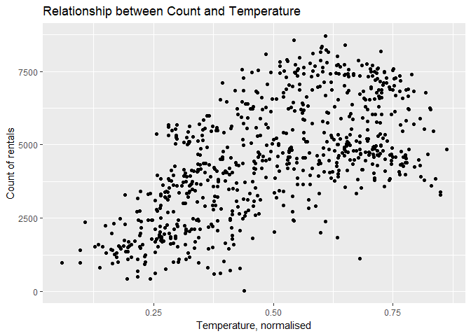
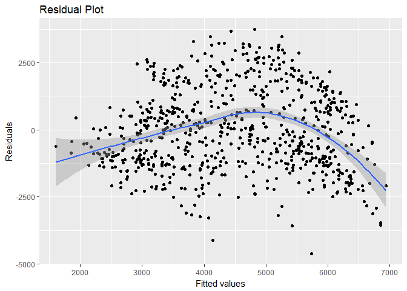

Simple Linear Regression
================

<https://en.wikipedia.org/wiki/Linear_regression> Linear regression is a linear approach to modelling the relationship between a scalar response (or dependent variable) and one or more explanatory variables (or independent variables).

I'll produce a simple linear model using data from a bike sharing system.

<http://archive.ics.uci.edu/ml/datasets/Bike+Sharing+Dataset> "Bike sharing systems are new generation of traditional bike rentals where whole process from membership, rental and return back has become automatic. Through these systems, user is able to easily rent a bike from a particular position and return back at another position. Currently, there are about over 500 bike-sharing programs around the world which is composed of over 500 thousands bicycles. Today, there exists great interest in these systems due to their important role in traffic, environmental and health issues."

``` r
#load tidyverse for easy manipulations, visualisations etc
library(tidyverse)
```

    ## Warning: package 'tidyverse' was built under R version 3.5.1

    ## -- Attaching packages ---------------------------------------- tidyverse 1.2.1 --

    ## v ggplot2 2.2.1     v purrr   0.2.5
    ## v tibble  1.4.2     v dplyr   0.7.6
    ## v tidyr   0.8.1     v stringr 1.3.1
    ## v readr   1.1.1     v forcats 0.3.0

    ## -- Conflicts ------------------------------------------- tidyverse_conflicts() --
    ## x dplyr::filter() masks stats::filter()
    ## x dplyr::lag()    masks stats::lag()

``` r
#read in the dataset
dataset <- read_csv("day.csv")
```

    ## Parsed with column specification:
    ## cols(
    ##   instant = col_integer(),
    ##   dteday = col_date(format = ""),
    ##   season = col_integer(),
    ##   yr = col_integer(),
    ##   mnth = col_integer(),
    ##   holiday = col_integer(),
    ##   weekday = col_integer(),
    ##   workingday = col_integer(),
    ##   weathersit = col_integer(),
    ##   temp = col_double(),
    ##   atemp = col_double(),
    ##   hum = col_double(),
    ##   windspeed = col_double(),
    ##   casual = col_integer(),
    ##   registered = col_integer(),
    ##   cnt = col_integer()
    ## )

``` r
#take a look at the data
head(dataset)
```

    ## # A tibble: 6 x 16
    ##   instant dteday     season    yr  mnth holiday weekday workingday
    ##     <int> <date>      <int> <int> <int>   <int>   <int>      <int>
    ## 1       1 2011-01-01      1     0     1       0       6          0
    ## 2       2 2011-01-02      1     0     1       0       0          0
    ## 3       3 2011-01-03      1     0     1       0       1          1
    ## 4       4 2011-01-04      1     0     1       0       2          1
    ## 5       5 2011-01-05      1     0     1       0       3          1
    ## 6       6 2011-01-06      1     0     1       0       4          1
    ## # ... with 8 more variables: weathersit <int>, temp <dbl>, atemp <dbl>,
    ## #   hum <dbl>, windspeed <dbl>, casual <int>, registered <int>, cnt <int>

``` r
#get a summary of the data
summary(dataset)
```

    ##     instant          dteday               season            yr        
    ##  Min.   :  1.0   Min.   :2011-01-01   Min.   :1.000   Min.   :0.0000  
    ##  1st Qu.:183.5   1st Qu.:2011-07-02   1st Qu.:2.000   1st Qu.:0.0000  
    ##  Median :366.0   Median :2012-01-01   Median :3.000   Median :1.0000  
    ##  Mean   :366.0   Mean   :2012-01-01   Mean   :2.497   Mean   :0.5007  
    ##  3rd Qu.:548.5   3rd Qu.:2012-07-01   3rd Qu.:3.000   3rd Qu.:1.0000  
    ##  Max.   :731.0   Max.   :2012-12-31   Max.   :4.000   Max.   :1.0000  
    ##       mnth          holiday           weekday        workingday   
    ##  Min.   : 1.00   Min.   :0.00000   Min.   :0.000   Min.   :0.000  
    ##  1st Qu.: 4.00   1st Qu.:0.00000   1st Qu.:1.000   1st Qu.:0.000  
    ##  Median : 7.00   Median :0.00000   Median :3.000   Median :1.000  
    ##  Mean   : 6.52   Mean   :0.02873   Mean   :2.997   Mean   :0.684  
    ##  3rd Qu.:10.00   3rd Qu.:0.00000   3rd Qu.:5.000   3rd Qu.:1.000  
    ##  Max.   :12.00   Max.   :1.00000   Max.   :6.000   Max.   :1.000  
    ##    weathersit         temp             atemp              hum        
    ##  Min.   :1.000   Min.   :0.05913   Min.   :0.07907   Min.   :0.0000  
    ##  1st Qu.:1.000   1st Qu.:0.33708   1st Qu.:0.33784   1st Qu.:0.5200  
    ##  Median :1.000   Median :0.49833   Median :0.48673   Median :0.6267  
    ##  Mean   :1.395   Mean   :0.49538   Mean   :0.47435   Mean   :0.6279  
    ##  3rd Qu.:2.000   3rd Qu.:0.65542   3rd Qu.:0.60860   3rd Qu.:0.7302  
    ##  Max.   :3.000   Max.   :0.86167   Max.   :0.84090   Max.   :0.9725  
    ##    windspeed           casual         registered        cnt      
    ##  Min.   :0.02239   Min.   :   2.0   Min.   :  20   Min.   :  22  
    ##  1st Qu.:0.13495   1st Qu.: 315.5   1st Qu.:2497   1st Qu.:3152  
    ##  Median :0.18097   Median : 713.0   Median :3662   Median :4548  
    ##  Mean   :0.19049   Mean   : 848.2   Mean   :3656   Mean   :4504  
    ##  3rd Qu.:0.23321   3rd Qu.:1096.0   3rd Qu.:4776   3rd Qu.:5956  
    ##  Max.   :0.50746   Max.   :3410.0   Max.   :6946   Max.   :8714

``` r
str(dataset)
```

    ## Classes 'tbl_df', 'tbl' and 'data.frame':    731 obs. of  16 variables:
    ##  $ instant   : int  1 2 3 4 5 6 7 8 9 10 ...
    ##  $ dteday    : Date, format: "2011-01-01" "2011-01-02" ...
    ##  $ season    : int  1 1 1 1 1 1 1 1 1 1 ...
    ##  $ yr        : int  0 0 0 0 0 0 0 0 0 0 ...
    ##  $ mnth      : int  1 1 1 1 1 1 1 1 1 1 ...
    ##  $ holiday   : int  0 0 0 0 0 0 0 0 0 0 ...
    ##  $ weekday   : int  6 0 1 2 3 4 5 6 0 1 ...
    ##  $ workingday: int  0 0 1 1 1 1 1 0 0 1 ...
    ##  $ weathersit: int  2 2 1 1 1 1 2 2 1 1 ...
    ##  $ temp      : num  0.344 0.363 0.196 0.2 0.227 ...
    ##  $ atemp     : num  0.364 0.354 0.189 0.212 0.229 ...
    ##  $ hum       : num  0.806 0.696 0.437 0.59 0.437 ...
    ##  $ windspeed : num  0.16 0.249 0.248 0.16 0.187 ...
    ##  $ casual    : int  331 131 120 108 82 88 148 68 54 41 ...
    ##  $ registered: int  654 670 1229 1454 1518 1518 1362 891 768 1280 ...
    ##  $ cnt       : int  985 801 1349 1562 1600 1606 1510 959 822 1321 ...
    ##  - attr(*, "spec")=List of 2
    ##   ..$ cols   :List of 16
    ##   .. ..$ instant   : list()
    ##   .. .. ..- attr(*, "class")= chr  "collector_integer" "collector"
    ##   .. ..$ dteday    :List of 1
    ##   .. .. ..$ format: chr ""
    ##   .. .. ..- attr(*, "class")= chr  "collector_date" "collector"
    ##   .. ..$ season    : list()
    ##   .. .. ..- attr(*, "class")= chr  "collector_integer" "collector"
    ##   .. ..$ yr        : list()
    ##   .. .. ..- attr(*, "class")= chr  "collector_integer" "collector"
    ##   .. ..$ mnth      : list()
    ##   .. .. ..- attr(*, "class")= chr  "collector_integer" "collector"
    ##   .. ..$ holiday   : list()
    ##   .. .. ..- attr(*, "class")= chr  "collector_integer" "collector"
    ##   .. ..$ weekday   : list()
    ##   .. .. ..- attr(*, "class")= chr  "collector_integer" "collector"
    ##   .. ..$ workingday: list()
    ##   .. .. ..- attr(*, "class")= chr  "collector_integer" "collector"
    ##   .. ..$ weathersit: list()
    ##   .. .. ..- attr(*, "class")= chr  "collector_integer" "collector"
    ##   .. ..$ temp      : list()
    ##   .. .. ..- attr(*, "class")= chr  "collector_double" "collector"
    ##   .. ..$ atemp     : list()
    ##   .. .. ..- attr(*, "class")= chr  "collector_double" "collector"
    ##   .. ..$ hum       : list()
    ##   .. .. ..- attr(*, "class")= chr  "collector_double" "collector"
    ##   .. ..$ windspeed : list()
    ##   .. .. ..- attr(*, "class")= chr  "collector_double" "collector"
    ##   .. ..$ casual    : list()
    ##   .. .. ..- attr(*, "class")= chr  "collector_integer" "collector"
    ##   .. ..$ registered: list()
    ##   .. .. ..- attr(*, "class")= chr  "collector_integer" "collector"
    ##   .. ..$ cnt       : list()
    ##   .. .. ..- attr(*, "class")= chr  "collector_integer" "collector"
    ##   ..$ default: list()
    ##   .. ..- attr(*, "class")= chr  "collector_guess" "collector"
    ##   ..- attr(*, "class")= chr "col_spec"

So "dataset" is a data frame with 731 rows and 16 columns. Each row represent a single entry, one day, in which data is recorded about climate conditions, such as temperature and humidity, and the number of bike rentals which occur. This information is stored in the columns.

I'm building a simple linear regression, so I'll need inly two of these columns. I'll keep "cnt" as the response variable and "temp" as the predictor. "temp" is normalised to take values in \[0,1\], and is in celsius.

``` r
newdata <- select(dataset, cnt, temp)
summary(newdata)
```

    ##       cnt            temp        
    ##  Min.   :  22   Min.   :0.05913  
    ##  1st Qu.:3152   1st Qu.:0.33708  
    ##  Median :4548   Median :0.49833  
    ##  Mean   :4504   Mean   :0.49538  
    ##  3rd Qu.:5956   3rd Qu.:0.65542  
    ##  Max.   :8714   Max.   :0.86167

And now I'll visualise my data to get the gist of how each variable is distributed. I'll use a histogram with a red line indicating the median, and a blue line for the mean.

``` r
#plot cnt as a histogram, with mean and median lines
ggplot(newdata, aes(x=cnt)) + 
  geom_histogram() + 
  labs(y="frequency", title = "Histogram of count frequency") +
  geom_vline(xintercept = mean(dataset$cnt), color = "blue") + 
  geom_vline(xintercept = median(dataset$cnt), color = "red")
```

    ## `stat_bin()` using `bins = 30`. Pick better value with `binwidth`.


``` r
#plot temp as a histogram, with mean and median lines
ggplot(newdata, aes(x=temp)) + 
  geom_histogram() + 
  labs(y="frequency", title = "Histogram of temp frequency") +
  geom_vline(xintercept = mean(dataset$temp), color = "blue") + 
  geom_vline(xintercept = median(dataset$temp), color = "red")
```

    ## `stat_bin()` using `bins = 30`. Pick better value with `binwidth`.


And finally, a scatterplot to see the relationship.

``` r
#plot cnt and temp as a scatter graph
ggplot(newdata, aes(x=temp, y=cnt)) + 
  geom_point() + 
  labs(x="Temperature, normalised", y="Count of rentals", title = "Relationship between Count and Temperature")
```



Each point represent a single day. Note how the count increases with the temperature; the trend does not seem to be linear, as the relationship visibly flattens after x=0.5. I'll fit a simple linear regression and evaluate the model's performance, nonetheless.

I wish to solve the equation Count = intercept + slope \* Temperature, or Y= c + m \* X

The lm function will fit a linear model to the data by minimising the sum of the squares of the distances between my data points and the regression line (The "Least Squares" approach).

``` r
#fit the model
mod = lm(cnt ~ temp, data = newdata)

#summarise results
summary(mod)
```

    ## 
    ## Call:
    ## lm(formula = cnt ~ temp, data = newdata)
    ## 
    ## Residuals:
    ##     Min      1Q  Median      3Q     Max 
    ## -4615.3 -1134.9  -104.4  1044.3  3737.8 
    ## 
    ## Coefficients:
    ##             Estimate Std. Error t value Pr(>|t|)    
    ## (Intercept)   1214.6      161.2   7.537 1.43e-13 ***
    ## temp          6640.7      305.2  21.759  < 2e-16 ***
    ## ---
    ## Signif. codes:  0 '***' 0.001 '**' 0.01 '*' 0.05 '.' 0.1 ' ' 1
    ## 
    ## Residual standard error: 1509 on 729 degrees of freedom
    ## Multiple R-squared:  0.3937, Adjusted R-squared:  0.3929 
    ## F-statistic: 473.5 on 1 and 729 DF,  p-value: < 2.2e-16

And plot this linear model as a scatterplot.

``` r
#plot scatter
ggplot(newdata, aes(x=temp, y=cnt)) + 
  geom_point() + 
  stat_smooth(method = "lm", col = "red") +
  labs(x="Temperature, normalised", y="Count of rentals", title = "Relationship between Count and Temperature")
```


I can make a few observations from my results: -This relationship is potentially non-linear, and this may be worth further inspection. -The R^2 value, 0.3937, is rather small, and so the model does little to explain the data variance. -The residual standard error, the quantity of rentals I can expect an estimate from a given temperature to vary by, is large.

I'll examine the residuals for more information.

``` r
ggplot(mod, aes(x=.fitted, y=.resid)) + 
  geom_point() +
  geom_smooth() +
  labs(x="Fitted values", y="Residuals", title = "Residual Plot")
```

    ## `geom_smooth()` using method = 'loess'



Clearly, there is a trend in the residuals, and many fall far from the trend line, which may suggest poor model performance. Perhaps alternative models should be considered?

In summary, I have fitted a linear regression to data (instances of bike shares) to examine a potential link between observed values of variables (daily temperature and quantities rented). Using residual analysis, I have evaulated the performance of this model, and concluded the model is far from the optimal choice.
